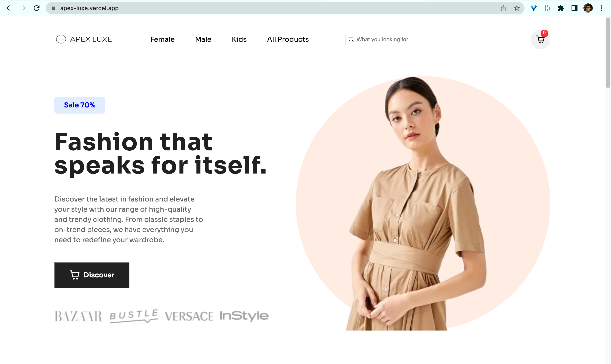

# Apex Luxe
This project is a full stack e-commerce website built with Next js. I created this project as part of a Mini Project for the Web Programming Class that I am taking at Semester 4 of my BTech degree at KJSCE.

## Table of contents

- [Overview](#overview)
  - [The challenge](#the-challenge)
  - [Screenshot](#screenshot)
  - [Links](#links)
  - [Credit](#credit)
- [Process](#process)
  - [Built with](#built-with)
  - [Useful resources](#useful-resources)
- [Author](#author)
- [Getting Started](#getting-started)


## Overview

### The challenge

- Implementing cart functionality 
- Connecting to Sanity as back end database for e-commerce
- Connecting Stripe APIs to power online payment processing for e-commerce

### Screenshot

For now the search bar is only for styling purposes and doesn't work properly yet

### Links
The site is deployed on Vercel.
- [Live Site URL](https://apex-luxe.vercel.app)

### Credit
[Figma Web Design & UI kit i used for this project is design by Weird Design Studio](https://ui8.net/ui-market/products/e-commerce-ui-website-design?status=7)

### Built with

- Semantic HTML5 markup
- CSS custom properties
- Flexbox
- CSS Grid
- [Next JS](https://nextjs.org/) - React Framework for Production
- [Sanity](https://www.sanity.io/) - Sanity is a customizable solution that treats content as data to power digital business.
- [Stripe](https://stripe.com/en-gb-us) - APIs to power online payment processing for e-commerce
- [react-hot-toast](https://react-hot-toast.com/) - react library that adds beautiful notifications to our react application. 
- [react icons](https://react-icons.github.io/react-icons/) - JS library to add icons
- [swiper js](https://swiperjs.com/) - JS library to add slider component
- [canvas-confetti](https://www.npmjs.com/package/canvas-confetti) - Lightweight JS plugin to create a confetti celebration explosion effect. It draws confetti graphics on the HTML canvas element. 

### Useful resources
- [UI/UX Design Resources](https://ui8.net/) - This website provide many UI/UX design, some are even free.
- [Tutorial Modern Full Stack ECommerce React Application with Stripe by JavaScript Mastery](https://www.youtube.com/watch?v=4mOkFXyxfsU&t=10459s) - This youtube tutorial really helps in understanding Next js and the use of sanity and stripe for e-commerce
- [Swiper React Components](https://swiperjs.com/react#styles)
- [Customize Prev/Next Button of Swiper Arrows](https://www.timo-ernst.net/blog/2020/09/12/arrows-in-react-swiper-js-how-to-customize-prev-next-button/)

## Link

- Github - (https://github.com/AdvaitT17/ApexLuxe.git)

## Getting Started

To run the development server:

```bash
npm run dev
```
